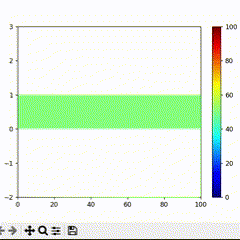

# MP-3
BSc(H) Physics, Mathematical Physics -3 Codes

## Crank-Nicolson Method
Heat equation solved using implicit crank-nicolson method

## Finite-Difference Method
### Heat equation
Heat equation solved using the explicit finite difference method

### Wave equation
Wave equation solved using explicit finite difference method

## Relaxation Method
Laplace's Equation solved using the relaxation method

